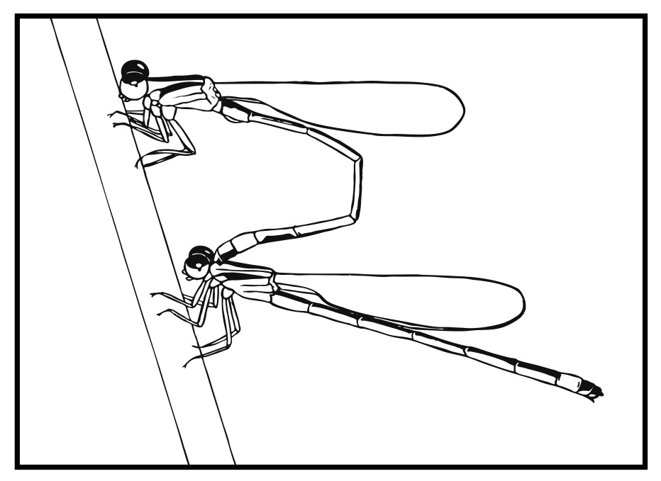

## Especiación y Consecuencias Evolutivas de la Hibridación

Bienvenido a este repositorio. En él encontrarás el contenido que imparto como parte del curso de especiación y Consecuencias evolutivas de la hibridación en el posgrado en Ciencias del INECOL.

Aquí encontrarás el contenido para los siguientes temas (Según el programa de Enero del 2025):

- Seminario 2: Genómica: técnicas y aplicaciones.
- Taller 1: Cálculo índices de aislamiento precigótico y postcigótico.
- Tema 11: Consecuencias evolutivas de la Hibridación y Reforzamiento.
- Taller 3: Reforzamiento.
 
 Si tienes cualquier duda u observación con respecto al contenido de este repositorio, no dudes en hacermelo saber. Mándame un correo a `bio.l.rodrigo.arce@gmail.com`.
 
 