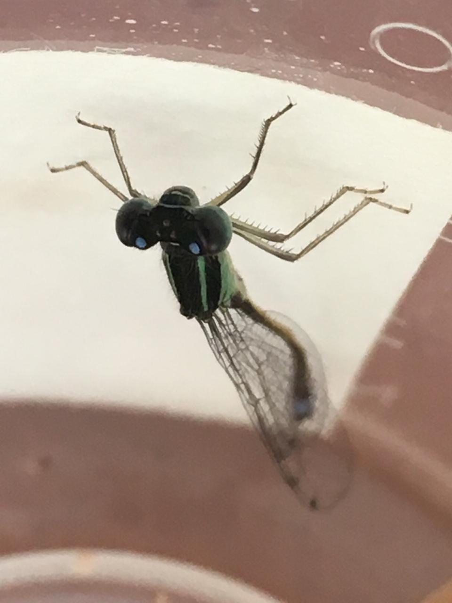

## Especiación y Consecuencias Evolutivas de la Hibridación

Bienvenido a este repositorio. En el encontrarás el contenido que impartí como parte de este curso en el posgrado en Ciencias del INECOL.
Encontrarás el contenido para los siguientes temas:

- Taller 1: Cálculo de barreras precigóticas y postcigóticas
- Seminario 1: Genómica: técnicas y aplicaciones
- Tema 11: Reforzamiento
- Taller 3: Reforzamiento
 
 **Si tienes cualquier duda u observación con respecto al contenido de este repositorio, no dudes en hacermelo saber**
 
 